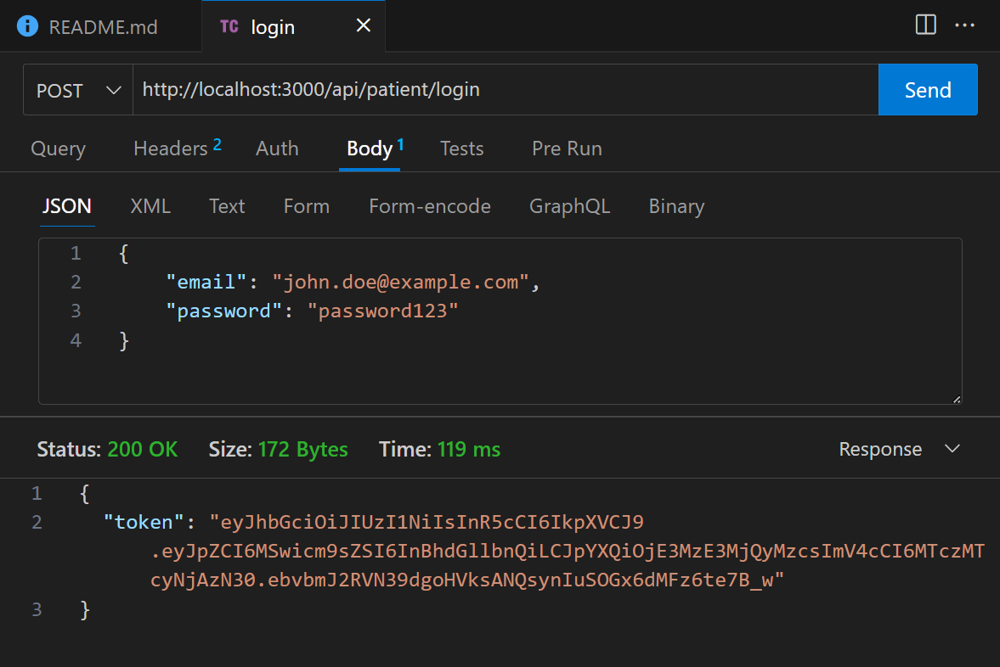
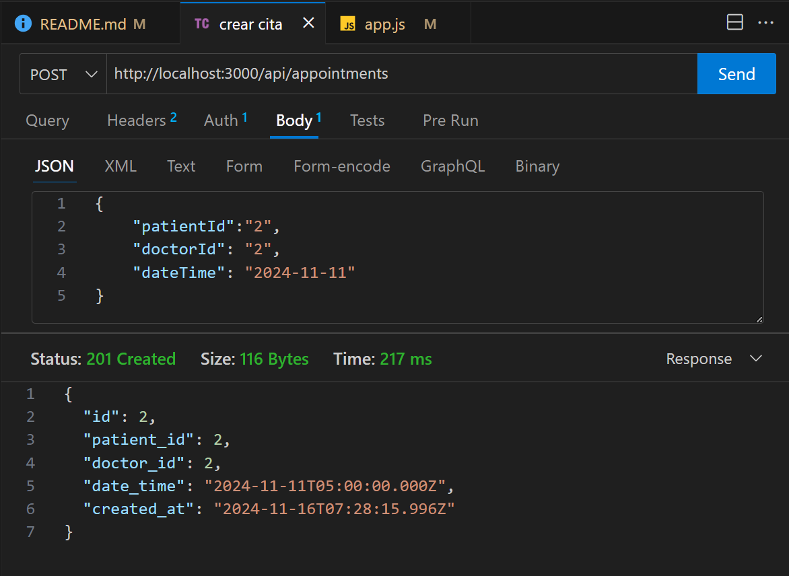
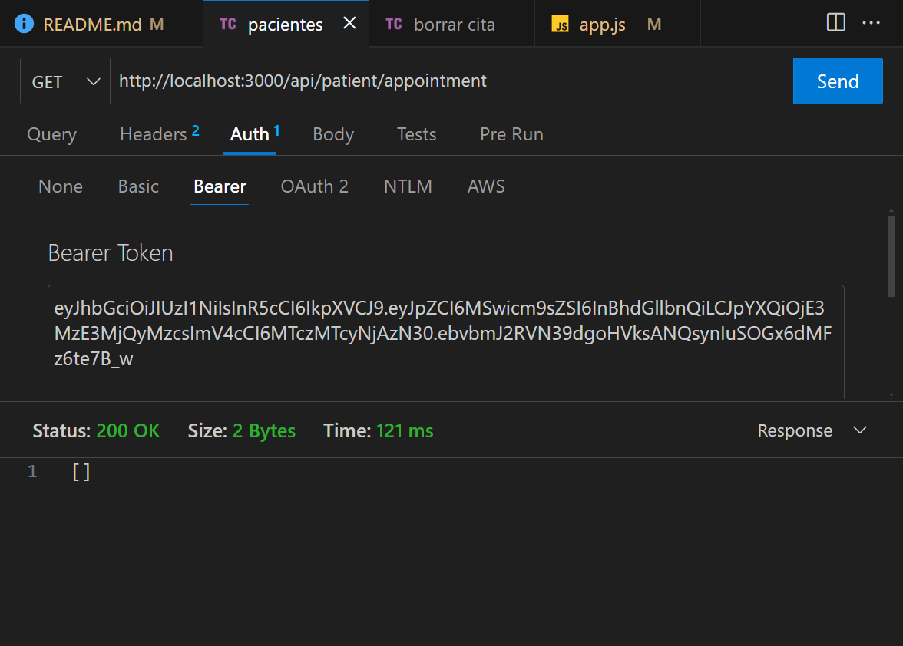
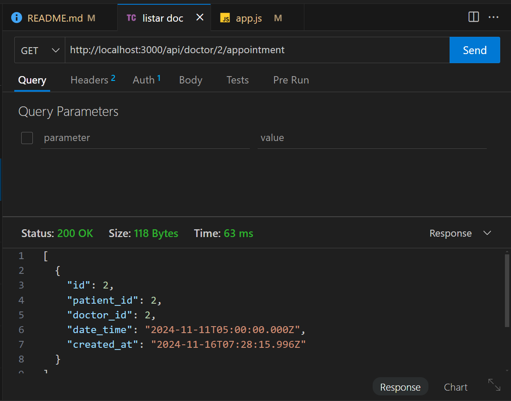

# Parcial Backend

Endpoint para Login

Se puede probar con esta ruta:
http://localhost:3000/api/patient/login

Endpoint para crear cita

Se puede probar con esta ruta:
http://localhost:3000/api/appointments

El endpoint para listar las citas de un paciente
se prueba con esta ruta:
http://localhost:3000/api/patient/appointment

El endpoint para eliminar una cita se puede probar asi:
http://localhost:3000/api/appointments/1

Endpoint para Obtener las citas que tiene un medico
Se puede probar asi:
http://localhost:3000/api/doctor/2/appointment

